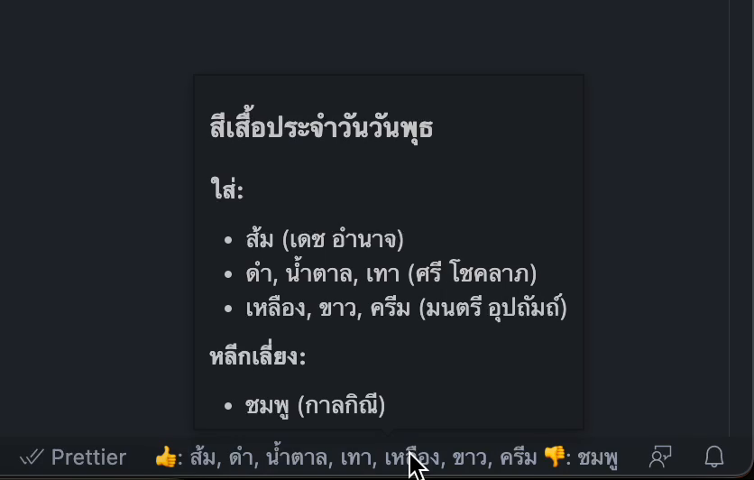

# สีเสื้อวันนี้: Shirt Colours of the Day (Thai Language)

คุณเคยประสบปัญหาใส่สีเสื้อไม่ตรงกับตารางสีเสื้อหรือไม่? คุณเคยใส่สีเสื้อกาลกิณีในวันศุกร์ตอนบ่ายที่คุณต้อง deploy หรือเปล่า?

ปัญหานี้จะหมดไป เพียงคุณลงส่วนเสริมนี้!

เพียงแค่เหลือบตามองไปมุมขวาล่างของ VS Code คุณก็จะได้สีเสื้อที่ควรใส่วันนี้พร้อมกับสีที่ควรเลี่ยงไปในชั่วพริบตา!

นอกจากนี้ ถ้าคุณเอาเมาส์ไปชี้บนสีเสื้อ คุณก็จะได้ข้อมูลเพิ่มเติมว่าสีไหน เหมาะกับอะไรทันที!

## เจอบั๊คหรือมีข้อเสนอแนะ

เจอบั๊ค? อยากเสนอแนะ? เราแนะนำให้คุณเสนอแนะเป็น PR มาเลย เพราะนี่งานเผา 555

## ติดต่อ

[@thammarith](https://twitter.com/thammarith) บนทวิตเตอร์

## Acknowledgement

- Icon image from [Wikimedia Commons by Shirtexpert](https://commons.wikimedia.org/wiki/File:Shirtexpert.png) used under [the Creative Commons Attribution-Share Alike 4.0 International license](https://creativecommons.org/licenses/by-sa/4.0)
